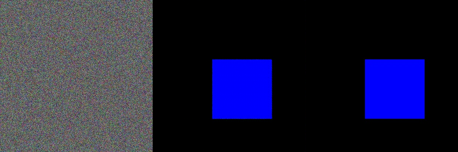

# Sentinel-Pulse 🛰️🌊

**Sentinel-Pulse** is a high-precision Urban Resilience Agent that uses a Conditional GAN (Pix2Pix) to simulate environmental catastrophe on city infrastructure. By treating satellite imagery as a query and producing a deterministic geographical response, it serves as a tool for urban disaster planning.

## 🧠 Architecture
- **Generator**: U-Net 256 with 8-layer Skip Connections to preserve fine-grained urban textures.
- **Discriminator**: 70x70 PatchGAN for localized "realism" verification.
- **Objective**: Combined Adversarial Loss and L1 Pixel-Distance Loss ($\lambda=100$).
- **Accelerator**: Fully optimized for Apple Silicon (Metal Performance Shaders).

## 🛠️ Folder Structure
- `data/`: Raw and stitched [Satellite | Flood] pairs.
- `src/models/`: Generator and Discriminator definitions.
- `src/utils/`: Data processors and loaders.
- `engine.py`: The core training logic.

## 🚀 Quick Start
1. **Prepare Data**: Place satellite JPGs and flood PNGs in `data/raw/`.
2. **Stitch**: `python3 src/utils/processor.py`
3. **Train**: `python3 src/engine.py`

## 📊 Results (Sanity Check)
The model has been verified using synthetic data to ensure skip-connection integrity and L1 convergence:
